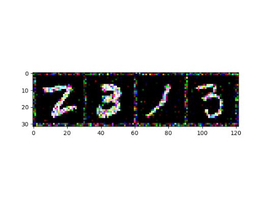
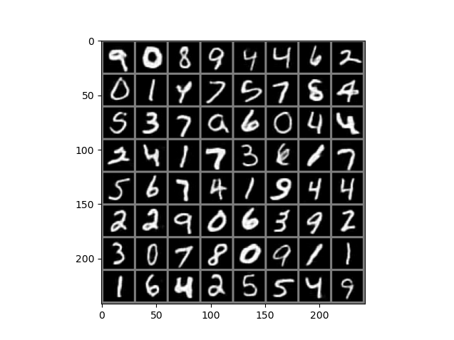

# Auto-Encoder

## INTRO
自动编码器是一种可以进行 ***无监督***  学习的神经网络模型

一般来说由两部分组成：

1.进行核心特征提取的编码部分

    编码器部分主要负责对输入数据进行压缩以及提取数据中的核心特征

2.实现数据重构的解码部分

    解码器主要是对在编码器中提取的核心特征进行展开并重新构造出之前的输入数据


这是一个简化的自动编码器模型

主要结构是神经网络

左边是输入层

输入层通过神经网络传递得到中间输入数据的和向您特征

这就完成了编码过程

然后再传到一个逆向的神经网络中

核心特征会被解压并且重构

得到一个和输入数据相近的输出数据

自动编码器最大的用途就是实现输入数据的清洗 ！！！

比如说去除输入数据中的噪声数据、对输入数据的某些关键特征进行增强和放大 ！！！

## Dev and techs ?
1. PyTorch
2. PyCharm

## Dataset ?

MNIST

## 构建马赛克


```python
noisy_images = img + 0.5*np.random.randn(*img.shape)
noisy_images = np.clip(noisy_images, 0., 1.)
```

 

```python
X_test, _ = next(iter(data_loader_test))
img2 = X_test + 0.5*torch.randn(X_test.shape)
img2 = torch.clamp(img2, 0., 1.)
img2 = Variable(img2.view(-1,28*28)).cuda()
test_pred = model(img2)
img_test = test_pred.data.view(-1,1,28,28)
img2 = torchvision.utils.make_grid(img_test)
img2 = img2.numpy().transpose(1,2,0)
img2 = img2*std+mean
img2 = np.clip(img2, 0., 1.)
plt.imshow(img2)
plt.show()
# 解码效果
```


## 一、线性变换实现自动编码器模型

```python
# 训练结果
Using GPU for training!!!!! 
显卡数量：1
显卡型号：NVIDIA GeForce RTX 2060
Epoch: 0/5
--------------------------------------------------
Loss is : 0.0309
Epoch: 1/5
--------------------------------------------------
Loss is : 0.0224
Epoch: 2/5
--------------------------------------------------
Loss is : 0.0209
Epoch: 3/5
--------------------------------------------------
Loss is : 0.0201
Epoch: 4/5
--------------------------------------------------
Loss is : 0.0196
Validation..........

Process finished with exit code 0
```

 


## 二、卷积变换实现自动编码器模型

```python
# 训练结果
downloading datasets
finished downloading
torch.Size([64, 1, 28, 28])
[tensor(7), tensor(7), tensor(9), tensor(1)]
Using GPU for training!!!!! 
显卡数量：1
显卡型号：NVIDIA GeForce RTX 2060
Epoch: 0/5
--------------------------------------------------
Loss is : 0.0008
Epoch: 1/5
--------------------------------------------------
Loss is : 0.0004
Epoch: 2/5
--------------------------------------------------
Loss is : 0.0004
Epoch: 3/5
--------------------------------------------------
Loss is : 0.0004
Epoch: 4/5
--------------------------------------------------
Loss is : 0.0004
Validation..........

Process finished with exit code 0
```





