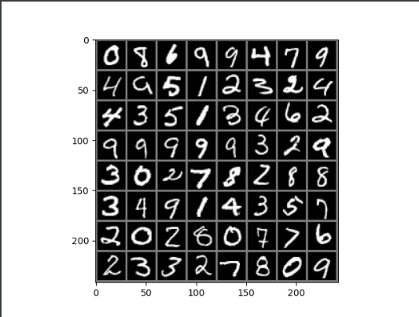

# RNN

### SOME  ERRORS


### 1.维度不匹配错误


发生错误的地方在93行损失函数:


```python
loss = loss_func(y_pred, y_train)
```

怀疑是交叉熵损失函数以及view()的使用上有问题。

解决了再回来更新

================================分割线====================================

回来更新了。

原来问题是出在数据变换上。

一开始数据变换的代码：

```python
transform = transforms.Compose([transforms.ToTensor(),
                                transforms.Lambda(lambda x: x.repeat(3,1,1)),
                                transforms.Normalize(mean=(0.5, 0.5, 0.5), std=(0.5, 0.5, 0.5))
])
```

这是标准差变换法

需要原始数据的均值（Mean）和标准差（Standard Division）来进行数据的标准化

标准化之后符合数据全部均值为0，标准差为1的正态分布。

删掉这一行想测试一下：（因为原来教程这一行是没有的）

```python
transforms.Lambda(lambda x: x.repeat(3,1,1))
```

结果报错：

```
RuntimeError: output with shape [1, 28, 28] doesn't match the broadcast shape [3, 28, 28]
```

这里错误分析：

✳应该是数据集里面有黑白的照片，导致channel只有1，而我们RGB一般设置是3，导致不匹配。

后来尝试直接用

```python
transforms.Normalize([0.5],[0.5])
```

✔发现成功！

### 2. RESULTS

[tensor(0), tensor(8), tensor(6), tensor(9), tensor(9), tensor(4), tensor(7), tensor(9),

 tensor(4), tensor(9), tensor(5), tensor(1), tensor(2), tensor(3), tensor(2), tensor(4), 

tensor(4), tensor(3), tensor(5), tensor(1), tensor(3), tensor(4), tensor(6), tensor(2), 

tensor(9), tensor(9), tensor(9), tensor(9), tensor(9), tensor(3), tensor(2), tensor(9),

 tensor(3), tensor(0), tensor(2), tensor(7), tensor(8), tensor(2), tensor(8), tensor(8),

 tensor(3), tensor(4), tensor(9), tensor(1), tensor(4), tensor(3), tensor(5), tensor(7), 

tensor(2), tensor(0), tensor(2), tensor(8), tensor(0), tensor(7), tensor(7), tensor(6), 

tensor(2), tensor(3), tensor(3), tensor(2), tensor(7), tensor(8), tensor(0), tensor(9)]



### 3. 训练结果

Epoch 0/10
--------------------------------------------------
Loss is: 0.0125, Training Accuracy: 73.7283%, Test Accuracy: 87.9600

Epoch 1/10
--------------------------------------------------
Loss is: 0.0057, Training Accuracy: 89.6400%, Test Accuracy: 92.0900

Epoch 2/10
--------------------------------------------------
Loss is: 0.0041, Training Accuracy: 92.8783%, Test Accuracy: 94.6200

Epoch 3/10
--------------------------------------------------
Loss is: 0.0035, Training Accuracy: 93.9000%, Test Accuracy: 94.9600

Epoch 4/10
--------------------------------------------------
Loss is: 0.0030, Training Accuracy: 94.6867%, Test Accuracy: 94.8400

Epoch 5/10
--------------------------------------------------
Loss is: 0.0027, Training Accuracy: 95.1567%, Test Accuracy: 95.0900

Epoch 6/10
--------------------------------------------------
Loss is: 0.0025, Training Accuracy: 95.4983%, Test Accuracy: 95.7100

Epoch 7/10
--------------------------------------------------
Loss is: 0.0024, Training Accuracy: 95.7817%, Test Accuracy: 96.0000

Epoch 8/10
--------------------------------------------------
Loss is: 0.0023, Training Accuracy: 95.9833%, Test Accuracy: 95.1900

Epoch 9/10
--------------------------------------------------
Loss is: 0.0022, Training Accuracy: 96.1233%, Test Accuracy: 95.6900
