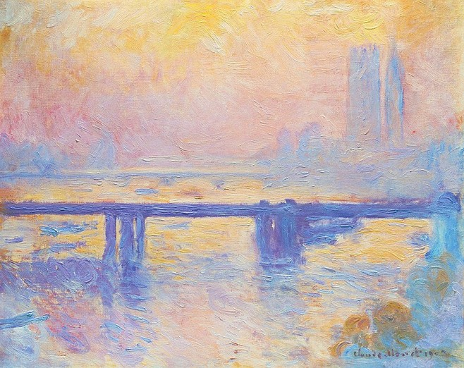
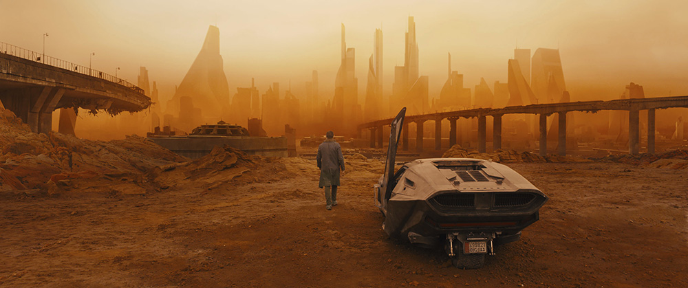
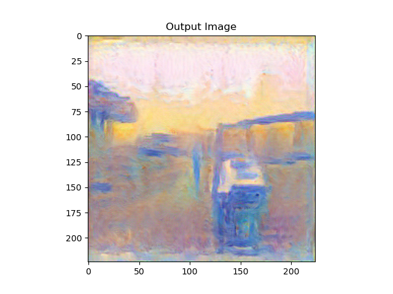

风格迁移结束了。

最后发现这个模型训练出来的效果并不好，可以说是非常差。。

不管我怎么调节内容图片以及风格图片的权重比，都不能使内容和风格处于一个平衡状态。

风格图片的风格迁移总是占上风。。。

同时也不知道是哪里除了bug，内容图片的损失总是为0，目前检查了很多次都不知道是什么原因。。

在这里挖个坑。有空再回来看看。。

​																							+

​																							||

